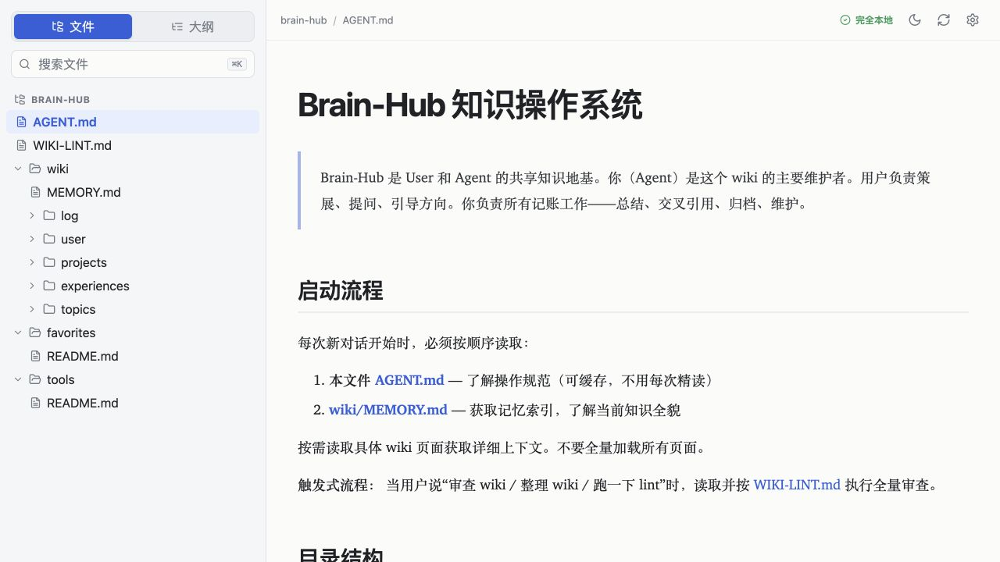

# Chrome Markdown

[English](README.md) | [简体中文](README.zh-CN.md)

A fast, local, and read-only Markdown reader for Chrome. Open a Markdown file directly in the browser and browse the rest of its folder from a clean file tree.



## Features

- Open local `.md`, `.markdown`, and `.mdx` files directly in Chrome
- Browse Markdown files and folders from the opened file's parent directory
- Lazy-load subfolders for fast startup in large repositories
- Search files or switch to a document outline
- Render GFM, syntax-highlighted code, KaTeX, Mermaid, and YAML frontmatter
- Resolve relative Markdown links and local images
- Switch files in place without a full-page flash
- Keep the browser URL fixed on the file while navigating headings
- Copy the current document's complete `file://` URL from the path bar
- Auto-refresh changed files
- Light and dark themes, adjustable text size and sidebar width
- English and Simplified Chinese interface

## Install

### From a release

1. Download and extract the ZIP from the [latest release](https://github.com/haoyubai212/chrome-markdown/releases/latest).
2. Open `chrome://extensions` and enable **Developer mode**.
3. Select **Load unpacked** and choose the extracted folder.
4. Open the extension details and enable **Allow access to file URLs**.
5. Open any local Markdown file in Chrome.

### From source

```bash
npm install
npm run build
```

Then load the generated `dist/` folder from `chrome://extensions`.

## How folder browsing works

When Chrome opens a local Markdown file, Chrome Markdown uses that file's parent directory as the tree root. The first level appears immediately, and each subfolder is read only when you expand it. Direct file opening does not show a system folder picker.

Selecting another file updates the reader in place. The browser address remains the originally opened file URL, while the internal path bar shows the active document and provides a button to copy its complete address.

The extension toolbar also opens a standalone reader where you can explicitly choose another folder.

## Privacy and permissions

- Files are read locally and are never uploaded.
- The extension is read-only and does not modify your files.
- No telemetry, remote scripts, or remote API calls.
- Chrome's `storage` permission stores reader settings; optional folder handles stay in browser IndexedDB.
- Local file access is used only for Markdown files you open and their descendant directories.
- `.git`, `node_modules`, `dist`, and `build` are always ignored; other hidden folders are hidden by default.
- Rendered HTML is sanitized with DOMPurify, and Mermaid runs with `securityLevel: strict`.

## Development

```bash
npm run dev       # http://127.0.0.1:5173/reader.html?demo=1
npm run lint
npm test
npm run build
npm run package   # chrome-markdown-1.0.1.zip
```

## License

[MIT](LICENSE)
